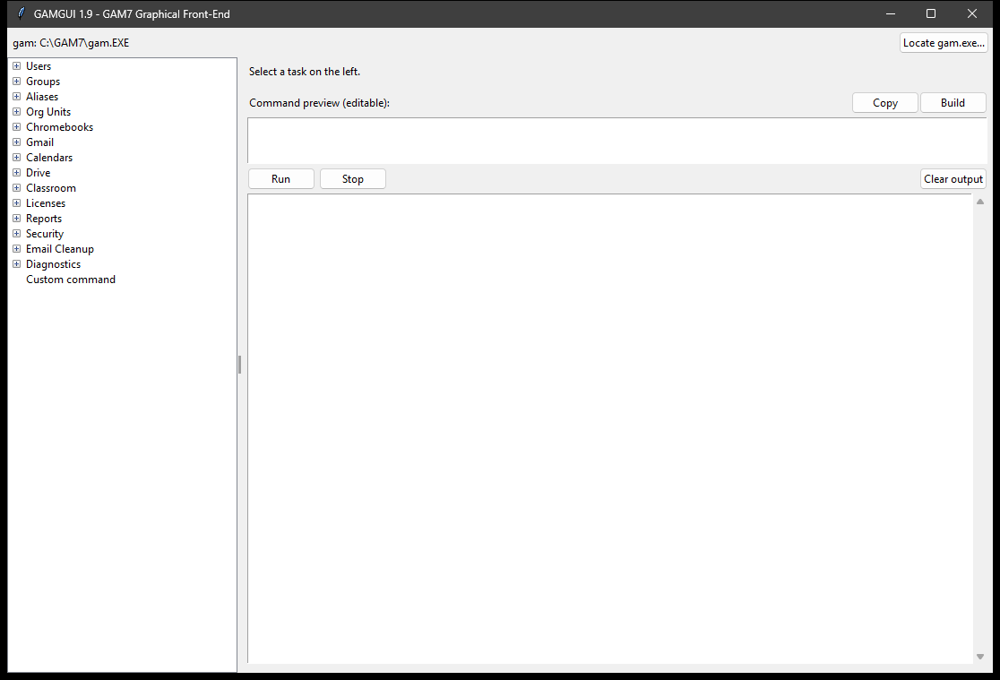

# GAMGUI

A point-and-click desktop front-end for [GAM7](https://github.com/GAM-team/GAM),
the command-line tool for Google Workspace administration. GAMGUI turns common
GAM tasks into fill-in forms across 14 categories, shows you the exact `gam`
command before it runs, and streams the output live - so you get GAM's power
without memorizing its syntax.


-informational)




> [!IMPORTANT]
> **GAMGUI is a front-end only.** It runs *your own* `gam` executable with your
> existing authorization and stores **no credentials of its own**. GAM must be
> installed and authorized on the machine, or GAMGUI has nothing to drive.

## Contents

- [Why GAMGUI](#why-gamgui)
- [Features](#features)
- [Requirements](#requirements)
- [Install and run (Windows)](#install-and-run-windows)
- [Task categories](#task-categories)
- [Safety and security](#safety-and-security)
- [Build from source](#build-from-source)
- [Troubleshooting](#troubleshooting)
- [Project files](#project-files)
- [Contributing](#contributing)
- [License and disclaimer](#license-and-disclaimer)

## Why GAMGUI

GAM is powerful but command-line only, which puts it out of reach for staff who
aren't comfortable in a terminal. GAMGUI is aimed at:

- **Admins** who want to run routine GAM tasks faster, with a preview and a log.
- **Teams** who want to delegate specific Google Workspace tasks (password
  resets, forwarding, Chromebook moves, phishing cleanup) to less technical
  staff, safely and with an audit trail.

## Features

- **75+ ready-made tasks** as simple forms; each shows the exact `gam` command
  in an editable preview **before** it runs - nothing happens in secret.
- **Shell-free execution** - arguments are passed directly to `gam`, so `&`,
  `|`, `>` and quotes inside subjects and search queries are handled safely
  (no accidental command splitting).
- **Confirmation for destructive actions** - deletes, powerwashes, domain-wide
  mail removal, etc. require an explicit "are you sure" showing the command.
- **Built-in phishing incident-response workflow** - search every mailbox for a
  malicious message, confirm, delete precisely by Message-ID, then pull
  Gmail/Drive audit evidence into a timestamped evidence folder.
- **Mailbox takeover audit** - one-click read-only check of the four places an
  attacker hides after phishing an account (filters, forwarding, send-as,
  delegates).
- **Live output + per-session logging** of every command and its result.
- **Custom-command mode** for anything not covered by a built-in task.
- **No runtime dependencies** - the app is one Python file using only the
  standard library (tkinter); the prebuilt Windows app needs no Python at all.

## Requirements

- **GAM7 installed and authorized** for your Google Workspace domain - this is
  the essential prerequisite: <https://github.com/GAM-team/GAM>
- **Windows 10/11** for the prebuilt app. macOS and Linux can run from source
  or a native build (see [Build from source](#build-from-source)).
- No Python needed to run the prebuilt app. Python 3.10+ (with tkinter) to run
  or build from source.

## Install and run (Windows)

1. Download `GAMGUI-vX.Y-Windows.zip` from the
   [Releases](../../releases) page and unzip it.
2. **Keep the `GAMGUI` folder together** - `GAMGUI.exe` needs the `_internal`
   folder beside it and will not run if separated. A good home is
   `C:\GAM7\GAMGUI\`.
3. Run **`GAMGUI\GAMGUI.exe`** (make a shortcut to it if you like).
4. If the top of the window shows `gam: (not found)`, click **Locate gam.exe...**
   and point it at your `gam` executable. GAMGUI auto-detects `gam` when it is
   on the PATH or sitting next to the app.

New, non-technical users: **HOW-TO-GUIDE.txt** is a full plain-English
walkthrough. **README.txt** is the complete reference and troubleshooting guide.

## Task categories

| Category | Example tasks |
|----------|---------------|
| Users | Create, reset password, suspend/restore, move OU, rename, delete, info, export |
| Groups | Create, add/remove members, sync from an OU, list members, export |
| Aliases | Create/delete alias, "what is this address?" |
| Org Units | Create, move users in, show OU tree, delete |
| Chromebooks | Info, move OU, disable/re-enable, powerwash, wipe users, export, last user |
| Gmail | Delegates, forwarding, vacation responder, signature, search/trash messages |
| Calendars | Show/grant/remove access, list events |
| Drive | List files, transfer My Drive, share, Shared Drives + membership |
| Classroom | List courses, add teacher, change owner, archive, delete |
| Licenses | Show counts, add/remove a license |
| Reports | Admin activity, login activity, user usage |
| Security | Sign out everywhere, deprovision, mailbox takeover audit, show filters, tokens |
| Email Cleanup | Domain-wide search / trash / delete, full incident-response workflow |
| Diagnostics | GAM version, domain info, OAuth info |

Plus a **Custom command** mode that accepts any `gam` command.

## Safety and security

GAMGUI executes real administrative commands against a live Google Workspace.
It is built to be careful, but it is a power tool - please note:

- **No permission model of its own.** GAMGUI can do whatever the machine's `gam`
  is authorized to do. Give it to people whose `gam` scope matches the trust you
  place in them, and consider who should have the destructive categories.
- **Preview first, then run.** The exact command is always shown before it runs;
  destructive tasks add a confirmation dialog.
- **Search before you delete.** For mail cleanup, run the read-only search and
  check the hit count before trashing or deleting; prefer *Trash* (recoverable
  ~30 days) over *Delete* (permanent) when unsure.
- **Logs may contain data.** Session and incident logs can include email
  addresses and message metadata. Store and share them accordingly.
- **Test in a non-production domain first** when trying unfamiliar tasks.

## Build from source

GAMGUI is a single Python file (`GAMGUI.py`, standard library only). To build
the Windows app:

```bat
py -m pip install pyinstaller
Build-EXE.bat
```

`Build-EXE.bat` runs `extract_tcl.py` and then PyInstaller in one-folder mode.
The extract step is **required on Python 3.14+**: Tcl/Tk 9 stores its script
library inside the DLL as a virtual zip filesystem, which PyInstaller does not
bundle on its own - without it the app crashes at startup with
`Tcl data directory _tcl_data not found`. `extract_tcl.py` copies that library
to disk so it can be bundled via `--add-data`. The result is `dist\GAMGUI\` -
distribute the whole folder.

**macOS/Linux:** build on that OS with
`pyinstaller --onedir --windowed --name GAMGUI GAMGUI.py`. If you hit a missing
Tcl data error on Python 3.14+, apply the same `extract_tcl.py` + `--add-data`
approach shown in `Build-EXE.bat`. (Requires the `python3-tk` package on Linux.)

To run without building: `python GAMGUI.py`.

## Troubleshooting

| Symptom | Fix |
|---------|-----|
| Top bar shows `gam: (not found)` | Click **Locate gam.exe...**, or put `gam` on the PATH. |
| Commands return auth errors | Run **Diagnostics > OAuth info**; re-authorize GAM if scopes are missing. |
| `Tcl data directory _tcl_data not found` (building yourself) | Run `extract_tcl.py` before PyInstaller, or use `Build-EXE.bat`. |
| App won't start after unzip | Keep `GAMGUI.exe` and its `_internal` folder together in the same folder. |
| A domain-wide search shows `exit code 50/60` | Normal on large domains - some mailboxes are always skipped; the results are still valid. |
| A long task looks frozen | Domain-wide operations are slow; use **Stop** to cancel if needed. |

## Project files

| File | Purpose |
|------|---------|
| `GAMGUI.py` | The entire application (single file, standard library only) |
| `extract_tcl.py` | Build helper: extracts Tcl/Tk data from the DLL (Python 3.14+) |
| `Build-EXE.bat` | One-command Windows build |
| `HOW-TO-GUIDE.txt` | Plain-English guide for non-technical users |
| `README.txt` | Full reference and troubleshooting |
| `CHANGELOG.txt` | Version history |
| `NOTES.md` | Development notes, roadmap, and known limitations |

## Contributing

Issues and pull requests are welcome. `GAMGUI.py` uses a data-driven task
catalog (the `TASKS` dictionary), so adding a task is a few lines and needs no
new code. Please keep the app dependency-free (standard library only) so it
stays easy to build and audit.

## License and disclaimer

Licensed under the [Apache License 2.0](LICENSE).

GAMGUI executes real administrative commands against a live Google Workspace
through GAM. Review the command preview before running, and test in a
non-production domain first. Provided **as-is, without warranty**. This is an
independent project and is **not affiliated with or endorsed by** the GAM
project or Google.
