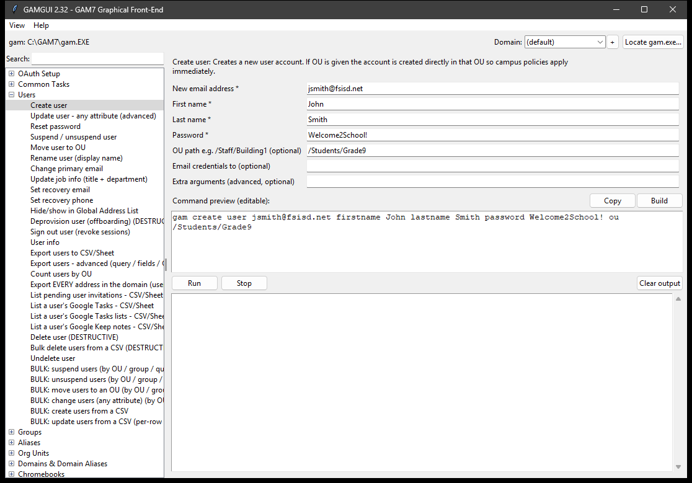
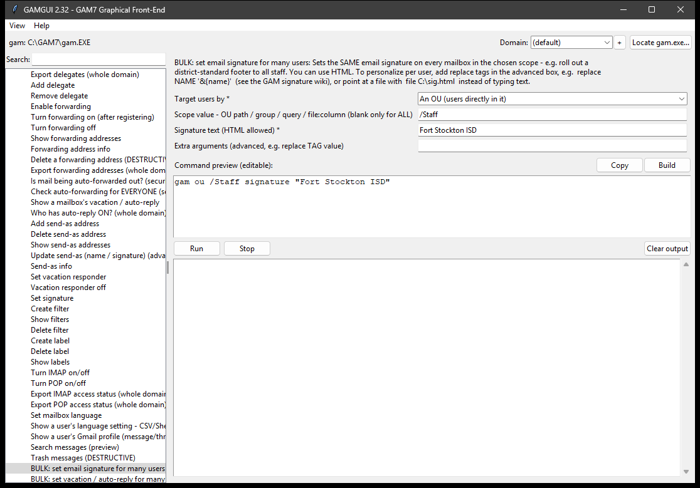
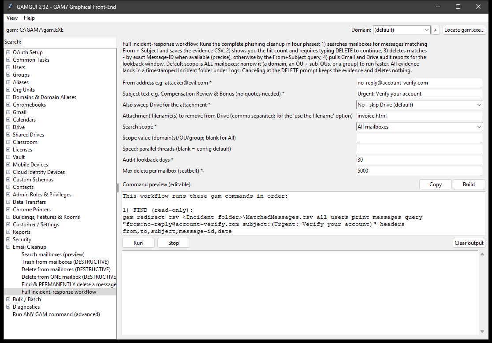
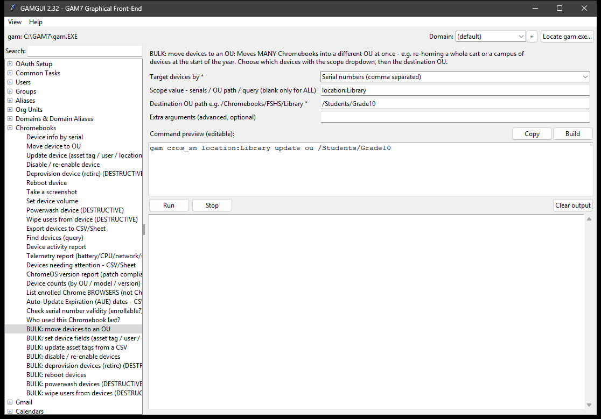
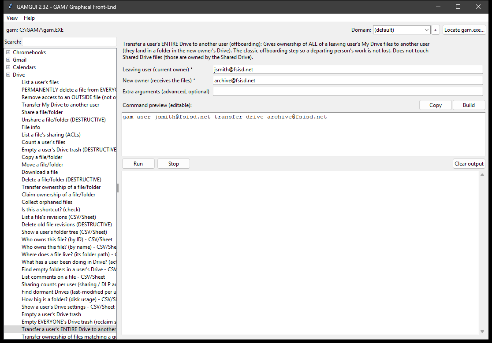
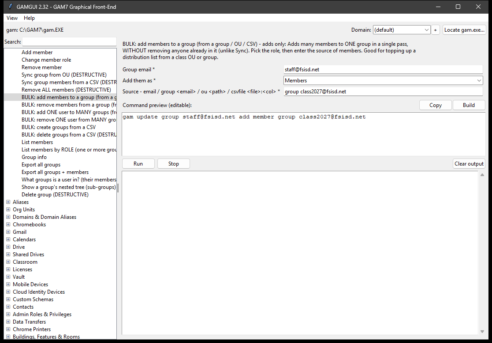
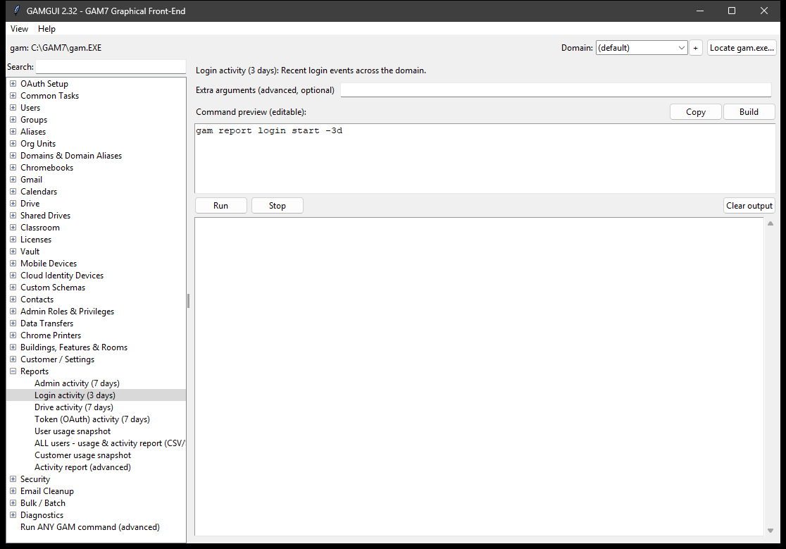

# GAMGUI

**A friendly, point-and-click window for [GAM7](https://github.com/GAM-team/GAM) -
the free tool that lets you manage your whole Google Workspace faster than
clicking through the Admin console.**

GAMGUI turns common GAM tasks into simple fill-in-the-blank forms, shows you the
exact command it will run **before** it runs, and prints the results in the
window. You get GAM's power without memorizing any commands.


-brightgreen)


---

## New here? Start with this

**What is Google Workspace administration?** If your school or organization uses
Gmail, Google Drive, Chromebooks, Classroom, or Google Groups, an administrator
manages all of it (accounts, passwords, sharing, devices) from the Google Admin
console in a web browser. That works, but doing the same thing for hundreds of
people - one click at a time - is slow and error-prone.

**What is GAM?** [GAM](https://github.com/GAM-team/GAM/wiki) (Google Apps
Manager) is a free, open-source tool that talks directly to Google and does
those admin jobs in seconds. Reset 500 passwords, move a graduating class's
Chromebooks, or delete a phishing email from every mailbox in the district -
things that take hours in the console take one command in GAM.

**So what's the catch?** GAM is a *command-line* tool. You type text commands
like `gam create user jsmith@school.org firstname John lastname Smith`. That
scares off a lot of people who would otherwise love what it can do.

**That's what GAMGUI fixes.** GAMGUI puts a normal windowed program on top of
GAM. You pick a task from a list, fill in a couple of boxes, and click **Run**.
GAMGUI writes the correct GAM command for you, shows it to you, runs it, and
displays the result. You learn GAM by *seeing* the commands it builds - or you
never have to look at them at all.

> [!IMPORTANT]
> **GAMGUI does not replace GAM - it drives it.** You still need GAM installed
> and connected to your Google Workspace on the computer (a one-time setup,
> linked below). GAMGUI stores no passwords of its own; it simply runs *your*
> GAM. If GAM isn't set up yet, GAMGUI will open but can't do anything.

---

## What can you actually do with it?

Here are real jobs GAMGUI makes easy. Each links to the matching GAM
documentation if you want to go deeper.

### Manage people (accounts)



- **Onboard a new employee or student:** create the account, set a password,
  put it in the right group/department.
- **Offboard someone who left:** suspend the account, reset the password, sign
  them out everywhere, and hand their email/files to a manager.
- **Everyday help-desk:** reset a password, un-suspend a locked account, look up
  everything about a user, move someone to a different department.
- **Do it in bulk:** **create hundreds of accounts from a CSV**, and **suspend,
  unsuspend, move to an OU, or change any attribute** across a whole OU, a
  group, a search query, or a spreadsheet of people - all in one pass.
- Learn more: [Users](https://github.com/GAM-team/GAM/wiki/Users) |
  [Groups](https://github.com/GAM-team/GAM/wiki/Groups) |
  [Organizational Units](https://github.com/GAM-team/GAM/wiki/Organizational-Units)

### Email (Gmail)



- **Set up forwarding** for someone who left, so their mail reaches a coworker.
- **Grant a delegate** so an assistant can read/answer a shared mailbox.
- **Turn on an out-of-office** reply for someone who forgot.
- **Fix a compromised account** after a phishing attack (see Security below).
- **Do it in bulk:** **roll out a district-standard signature**, set a **summer
  auto-reply**, **turn OFF auto-forwarding** everywhere after a phishing
  incident, or **add/remove a delegate** across a whole OU, group, or CSV of
  mailboxes at once.
- Learn more:
  [Forwarding](https://github.com/GAM-team/GAM/wiki/Users-Gmail-Forwarding) |
  [Delegates](https://github.com/GAM-team/GAM/wiki/Users-Gmail-Delegates) |
  [Send-As / Signature / Vacation](https://github.com/GAM-team/GAM/wiki/Users-Gmail-Send-As-Signature-Vacation)

### Stop a phishing attack across everyone at once



- **Search mailboxes** for a malicious email (read-only - it just finds it),
  then **delete it from everyone** with one guided workflow. You can scope the
  search to **all mailboxes, a specific domain, an OU, or a group** - and bump
  the parallel-thread count - to run it faster.
- **Optionally sweep the attachment out of Drive too:** the incident workflow
  can look for the malicious attachment by filename, show you every owned copy
  it finds, and (on the same confirmation) move them to the owner's Trash.
- **Audit a hacked account** to find the traps an attacker leaves behind:
  hidden mail-forwarding, filters that auto-delete incoming mail, extra
  delegates, and "send-as" identities.
- **Remediate in bulk:** a domain-wide **auto-forwarding sweep** finds every
  account forwarding mail out, and **"turn OFF auto-forwarding for many users"**
  shuts it down across the scope you choose.
- Learn more:
  [Messages/Threads](https://github.com/GAM-team/GAM/wiki/Users-Gmail-Messages-Threads) |
  [Filters](https://github.com/GAM-team/GAM/wiki/Users-Gmail-Filters) |
  [Deprovision](https://github.com/GAM-team/GAM/wiki/Users-Deprovision)

### Chromebooks (great for schools)



- **Move devices** to the right OU so the right policies apply.
- **Disable a lost/stolen Chromebook**, or re-enable a found one.
- **Powerwash or wipe** devices remotely (for example, an end-of-year reset of a
  cart or a whole grade level).
- **Do it in bulk:** **move, disable, deprovision, reboot, powerwash, or wipe**
  a whole cart, OU, or search query in one pass, and **import asset tags from a
  CSV**.
- **Plan ahead:** **Auto-Update Expiration (AUE) dates** per model,
  **devices-needing-attention**, **ChromeOS version** and **device-count**
  reports - export any of them to a Sheet or CSV.
- Learn more:
  [ChromeOS Devices](https://github.com/GAM-team/GAM/wiki/ChromeOS-Devices)

### Google Drive and file sharing



- **Transfer someone's entire Drive** to another person before you delete their
  account (so nothing is lost).
- **See what a user has shared** and fix over-shared files.
- **Do it in bulk:** **transfer, share, or unshare** every file matching a
  search query, **empty Drive trash** (one user or everyone), and **collect
  orphaned files** into a folder so nothing gets lost.
- **Manage Shared Drives** and who has access to them - including **bulk create,
  delete, add/remove a member, or move to an OU from a CSV** of Shared Drives.
- Learn more:
  [Drive files](https://github.com/GAM-team/GAM/wiki/Users-Drive-Files-Display) |
  [Drive permissions](https://github.com/GAM-team/GAM/wiki/Users-Drive-Permissions) |
  [Transfer](https://github.com/GAM-team/GAM/wiki/Users-Drive-Transfer) |
  [Shared Drives](https://github.com/GAM-team/GAM/wiki/Shared-Drives)

### Calendars, Classroom, Groups



- **Share a calendar** with a person or a group, or clean up events. **Push a
  shared calendar** (e.g. district events) onto a whole OU or group's lists at
  once, and show/hide it for everyone.
- **Manage Google Classroom** end to end: create/archive/restore courses, add or
  remove students and teachers (one at a time, from a group/OU, or from a CSV),
  topics, announcements, student groups, guardian invitations, and course
  invitations - and change a class's owner when a teacher leaves.
- **Groups in bulk:** **add or remove members** from a group/OU/CSV, **add or
  remove one person across many groups** at once, and **create or delete groups
  from a CSV**.
- Learn more:
  [Calendars](https://github.com/GAM-team/GAM/wiki/Calendars-Access) |
  [Classroom](https://github.com/GAM-team/GAM/wiki/Classroom-Courses) |
  [Group membership](https://github.com/GAM-team/GAM/wiki/Groups-Membership)

### See what's going on (reports)



- **Who changed what** in the Admin console, recent **logins**, and per-user or
  **all-user usage** - useful for security reviews and audits.
- **Security posture at a glance:** **2-Step Verification enrollment** (who
  still needs 2FA), Alert Center alerts, who has auto-forwarding or auto-reply
  on, IMAP/POP status, file-sharing counts, and **suspended / dormant-account**
  reports - all exportable to a Sheet or CSV.
- Learn more: [Reports](https://github.com/GAM-team/GAM/wiki/Reports)

Every category above is one click in GAMGUI. There's also an **"Extra arguments
(advanced)"** box on each task and a **"Run ANY GAM command (advanced)"**
console for anything not built into a form - so you're never limited to the
built-in tasks.

Any task that can list or export results lets you choose where they go with a
**"Save results to"** dropdown: the screen, a **Google Sheet**, or a **CSV file
on your PC**.

Prefer a darker screen? **View -> Dark mode** switches to a soft, low-contrast
dark theme and remembers your choice.

---

## Get it running (the whole path, from zero)

### Step 1 - Set up GAM (one time, required)
GAMGUI needs GAM installed and connected to your Google Workspace first.
Follow Google Apps Manager's own guide - it walks you through it:
**[How to install GAM7](https://github.com/GAM-team/GAM/wiki/How-to-Install-GAM7)**.
You'll need to be a Google Workspace **administrator** to authorize it.

> Not sure GAM is working yet? Open a terminal and run `gam version` and
> `gam info domain`. If those show your domain, you're ready for GAMGUI.

### Step 2 - Get GAMGUI (prebuilt - no building required)
Most people should just download the ready-to-run app:

1. Go to the **[Releases](https://github.com/GuruGabe/GAM-GUI-Overlay/releases)**
   page of this repository.
2. Pick **one** of two Windows options from the latest release:
   - **Portable (recommended for a school folder / network share):** download
     **`GAMGUI-<version>-Windows.zip`**, **unzip it**, and keep the whole
     `GAMGUI` folder together (the `GAMGUI.exe` needs the `_internal` folder
     next to it). A good place is `C:\GAM7\GAMGUI\`.
   - **Installer:** download **`GAMGUI-<version>-Setup.exe`** and run it. It
     installs to Program Files, adds Start-Menu and desktop shortcuts, and shows
     up in Add/Remove Programs like any Windows app. (Needs administrator
     rights.)
3. Start GAMGUI (double-click **`GAMGUI.exe`**, or use the shortcut the
   installer created). Windows may warn about an unrecognized app because it
   isn't code-signed; choose **More info -> Run anyway**.

macOS (`.dmg`) and Linux (`.deb` / `.rpm` / `.tar.gz`) builds are attached to
each release too. No Python or extra downloads are needed for any of them. If
you'd rather build it yourself, see [Build from source](#build-from-source)
below.

### Step 3 - First launch
- If the top of the window says `gam: (not found)`, click **Locate gam.exe...**
  and point it at your `gam` program. (GAMGUI finds it automatically when GAM is
  installed the normal way.)
- **Try a safe one first:** open **Diagnostics -> Domain info** and click
  **Run**. It only *reads* information and changes nothing - a perfect way to
  confirm everything works.

New, non-technical users: open **HOW-TO-GUIDE.txt** (included in the download)
for a complete, plain-English walkthrough. **README.txt** is the full reference.

### Step 4 - Keep it up to date

**The easy way - let the app do it.** GAMGUI checks for a newer release when it
starts (if you're online) and, if one exists, **asks** whether to update. Click
**Yes** and it closes, updates itself, and reopens on the new version - it never
updates without your OK. It knows how it was installed and does the right thing:

- a **portable** copy (an unzipped folder like `C:\GAM7\GAMGUI`) updates itself
  in place, keeping your `gamgui.ini` settings and `Logs`;
- an **installed** copy (from the Setup.exe below) re-runs the installer with a
  standard Windows administrator prompt.

You can also trigger it any time from **Help -> Check for updates now...**, and
turn the startup check on or off with **Help -> Check for updates at startup**.
Every download is verified against a **SHA-256** published in the release notes.

**The manual way - the bundled script.** The app folder also contains
**`updategamgui.ps1`** (it's what the in-app updater runs). You can run it
yourself, for example from a scheduled task:

```powershell
# close GAMGUI first, then from the folder holding the script:
powershell -ExecutionPolicy Bypass -File .\updategamgui.ps1
```

It auto-detects what you have - a **portable** copy, a **Setup.exe** install, or
**both** - and updates each one that's behind. Useful switches:
`-InstallType auto|zip|exe|both` (force a mode), `-InstallRoot "D:\path\GAMGUI"`
(a portable copy installed elsewhere), `-Force` (reinstall even if current),
`-Launch` (start GAMGUI when done), and `-Quiet` (no prompts - for a scheduled
task). Updating the Setup.exe install needs administrator rights; the portable
copy does not. The updater never force-closes a running portable copy - if it's
open, it asks you to close it first. Update activity is logged to
`<install>\Logs\GAMGUI-Update.log`.

---

## The task list at a glance

**Over 450 built-in tasks across 32 categories** (v2.38), plus the completeness
extras below. Use the **search box** at the top-left to find any command fast.

Many categories include **BULK** tasks that act on many objects at once. They
share a simple target picker - point an action at **an OU, an OU and its
sub-OUs, a group, a search query, a CSV column, or everyone** - so "suspend a
graduating class," "move a cart of Chromebooks," or "set a signature for all
staff" is one form, not a script.

| Category | What it's for | GAM docs |
|----------|---------------|----------|
| Common Tasks | The handful you do every day, pinned at the top | [Users](https://github.com/GAM-team/GAM/wiki/Users) |
| Users | Create, reset password, suspend, move, rename, deprovision, export; **bulk** create/suspend/unsuspend/move/change from an OU, group, query, or CSV | [Users](https://github.com/GAM-team/GAM/wiki/Users) |
| Groups | Create, members, roles, sync, settings, group info; **bulk** add/remove members and create/delete groups from a CSV | [Groups](https://github.com/GAM-team/GAM/wiki/Groups-Membership) |
| Aliases | Extra email addresses for a person or group; **bulk** create/delete from a CSV | [Aliases](https://github.com/GAM-team/GAM/wiki/Aliases) |
| Org Units | The "folders" that decide policies; move users between them; **bulk** create/delete OUs from a CSV | [Org Units](https://github.com/GAM-team/GAM/wiki/Organizational-Units) |
| Domains & Domain Aliases | Add/list domains and domain aliases | [Domains](https://github.com/GAM-team/GAM/wiki/Domains) |
| Shared Drives | Create/rename/hide/delete + membership (name-or-ID); **bulk** create/delete/add-member/remove-member/move-to-OU from a CSV | [Shared Drives](https://github.com/GAM-team/GAM/wiki/Shared-Drives) |
| Vault | Matters, holds, exports - full eDiscovery lifecycle | [Vault](https://github.com/GAM-team/GAM/wiki/Vault) |
| Gmail | Forwarding, delegates, send-as, filters, labels, IMAP/POP, signature; **bulk** signature/vacation/forwarding-off/delegate across a scope | [Gmail](https://github.com/GAM-team/GAM/wiki/Users-Gmail-Settings) |
| Chromebooks | Move, update, reboot, screenshot, powerwash, wipe, deprovision, inventory; **bulk** actions by OU/query/CSV; AUE dates, needs-attention, version & count reports | [ChromeOS](https://github.com/GAM-team/GAM/wiki/ChromeOS-Devices) |
| Mobile Devices | Approve, block, account-wipe, list | [Mobile](https://github.com/GAM-team/GAM/wiki/Mobile-Devices) |
| Cloud Identity Devices | Newer device API: devices and device users, approve/block/wipe, register company-owned | [Devices](https://github.com/GAM-team/GAM/wiki/Cloud-Identity-Devices) |
| Calendars | Share calendars, events, user calendar lists | [Calendars](https://github.com/GAM-team/GAM/wiki/Calendars-Access) |
| Drive | List, share, unshare, info, counts; **bulk** transfer/share/unshare by query, empty trash, collect orphans, transfer a whole Drive | [Drive](https://github.com/GAM-team/GAM/wiki/Users-Drive-Permissions) |
| Classroom | Courses (create/archive/restore/delete), students/teachers (single, from group/OU, or CSV), sync, topics, announcements, student groups, guardians, invitations, aliases | [Classroom](https://github.com/GAM-team/GAM/wiki/Classroom-Courses) |
| Google Meet | List a user's conferences; participants (attendance), recordings, transcripts | [Meet](https://github.com/GAM-team/GAM/wiki/Users-Meet) |
| Google Forms | Show a form's questions; export a form's responses (quiz / survey) | [Forms](https://github.com/GAM-team/GAM/wiki/Users-Forms) |
| Google Chat | List spaces, space members, and a user's messages (discovery / records) | [Chat](https://github.com/GAM-team/GAM/wiki/Users-Chat) |
| Licenses | See, assign, remove, swap Google licenses (by name or SKU); **bulk** by CSV/Sheet or across an OU/group/query | [Licenses](https://github.com/GAM-team/GAM/wiki/Licenses) |
| Custom Schemas | Define and set custom user directory fields; **bulk** set a field for many users from a CSV | [Schemas](https://github.com/GAM-team/GAM/wiki/Custom-User-Schemas) |
| Contacts | Domain shared contacts + personal/other contacts; **bulk** import shared contacts from a CSV | [Contacts](https://github.com/GAM-team/GAM/wiki/Contacts) |
| Admin Roles & Privileges | List/assign admin roles, custom roles, privileges | [Admin Roles](https://github.com/GAM-team/GAM/wiki/Administrator-Roles) |
| Data Transfers | Transfer a leaving user's app data to someone else | [Data Transfer](https://github.com/GAM-team/GAM/wiki/Data-Transfer) |
| Chrome Printers | Register, list, delete Chrome printers | [Printers](https://github.com/GAM-team/GAM/wiki/Printers) |
| Buildings/Features/Rooms | Buildings, room features, bookable calendar resources | [Resources](https://github.com/GAM-team/GAM/wiki/Calendar-Resources) |
| Reports | Admin/login/drive/token activity, failed sign-ins, usage snapshots; 2SV / suspended / dormant-account reports | [Reports](https://github.com/GAM-team/GAM/wiki/Reports) |
| Security | Sign out, deprovision, 2SV, ASPs, backup codes, takeover audit, tokens | [Deprovision](https://github.com/GAM-team/GAM/wiki/Users-Deprovision) |
| Email Cleanup | Scoped search / trash / delete (all mailboxes, a domain, an OU, or a group) + incident-response workflow, with an adjustable speed/threads setting | [Messages](https://github.com/GAM-team/GAM/wiki/Users-Gmail-Messages-Threads) |
| Customer / Settings | Account-wide customer and instance settings | [Customer](https://github.com/GAM-team/GAM/wiki/Customer) |
| Diagnostics | Version, domain info, authorization / service-account check | [Version & Help](https://github.com/GAM-team/GAM/wiki/Version-and-Help) |

**Completeness, without the clutter** - three layers make sure *nothing* in GAM
is out of reach while the forms stay beginner-friendly:

1. **Guided forms** for the common options on every command above.
2. An **"Extra arguments (advanced)"** box on essentially every task - type any
   extra GAM flag and it's appended to the command.
3. A **"Run ANY GAM command (advanced)"** console for the full long tail
   ([full command reference](https://github.com/GAM-team/GAM/wiki)).

**Managing more than one domain?** The **Domain** dropdown at the top runs any
command against a chosen tenant without changing your saved default - handy for
MSPs and anyone with several Workspace domains. It lists only `gam.cfg` sections
that are genuinely separate tenants (ones with their own credentials), so
single-domain setups just see `(default)`.

---

## Safety and security (please read)

GAMGUI runs real commands against your live Google Workspace. It's built to be
careful, but treat it with respect:

- **It can do whatever your GAM can do.** GAMGUI has no permissions of its own -
  give it to people you trust with that level of access, and think about who
  should have the destructive tasks (deleting, wiping, domain-wide mail delete).
- **You always see the command first,** and destructive tasks pop a
  confirmation showing exactly what will happen.
- **Search before you delete.** For mail cleanup, run the read-only search and
  check the count first; prefer **Trash** (recoverable ~30 days) over **Delete**
  (permanent) when unsure.
- **Test in a non-production/test domain first** when you're learning.
- **Logs can contain email addresses and message details** - store and share
  them with that in mind.

---

## Running and building from source (Windows, macOS, Linux)

GAMGUI is a single Python file (`GAMGUI.py`) using only the standard library
(tkinter), so it runs on all three platforms. You still need GAM installed and
authorized (see [Requirements](#requirements)).

### Run without building (simplest)

Requires Python 3.10+ **with tkinter**:

- **Windows** - tkinter is included with the python.org installer:
  ```bat
  py GAMGUI.py
  ```
- **macOS** - the python.org installer includes tkinter. If you use Homebrew
  Python, add it first with `brew install python-tk`:
  ```bash
  python3 GAMGUI.py
  ```
- **Linux** - install tkinter from your package manager, then run it:
  ```bash
  # Debian/Ubuntu:
  sudo apt install python3 python3-tk
  # Fedora/RHEL:
  sudo dnf install python3 python3-tkinter
  # Arch:
  sudo pacman -S tk
  python3 GAMGUI.py
  ```

### Build a standalone app (PyInstaller)

Install PyInstaller once: `pip install pyinstaller` (or `pip3 install ...`).

- **Windows:**
  ```bat
  Build-EXE.bat
  ```
- **macOS / Linux:**
  ```bash
  chmod +x build-app.sh
  ./build-app.sh
  ```

Both scripts run `extract_tcl.py` and then PyInstaller in one-folder mode. The
result is `dist/GAMGUI/` - copy the whole folder and keep it together (on macOS
you also get a `dist/GAMGUI.app` bundle). Run `dist/GAMGUI/GAMGUI` (or the
`.app`).

Prefer the raw PyInstaller command?

```bash
# Python 3.13 or earlier (Tcl/Tk 8.6):
pyinstaller --onedir --windowed --name GAMGUI GAMGUI.py

# Python 3.14+ (Tcl/Tk 9): extract the Tcl data first, then bundle it.
python3 extract_tcl.py
pyinstaller --onedir --windowed --name GAMGUI \
    --add-data "build_res/_tcl_data:_tcl_data" \
    --add-data "build_res/_tk_data:_tk_data" \
    GAMGUI.py
```

macOS/Linux use a colon (`:`) in `--add-data`; Windows uses a semicolon (`;`).

### Why the extract step (Python 3.14+)

Tcl/Tk 9 stores its script library inside the Tcl shared library as a virtual
zip filesystem, which PyInstaller doesn't bundle on its own - without it the app
crashes at startup with `Tcl data directory _tcl_data not found`.
`extract_tcl.py` copies that library to disk (and drops the `.enc` encoding
tables, which some endpoint security blocks) so PyInstaller can bundle it. On
Python 3.13 or earlier you can skip it.

### macOS Gatekeeper

The app isn't code-signed, so macOS may block it on first launch. Right-click the
app and choose **Open**, or clear the quarantine flag:

```bash
xattr -dr com.apple.quarantine dist/GAMGUI
```

---

## Run in a browser (Google Cloud Shell)

The desktop app draws a window, which needs a graphical display - so it can't
run in a headless terminal like [Google Cloud Shell](https://cloud.google.com/shell).
For that, use **`gam_web.py`**: a browser version that reuses the same task
catalog and command builder, runs `gam` on the server, and shows the output in
your browser. It uses only the Python standard library - no pip installs, no
tkinter, no display needed.

1. Open **Google Cloud Shell** and make sure GAM is installed and authorized
   there (see GAM's
   [install guide](https://github.com/GAM-team/GAM/wiki/How-to-Install-GAM7);
   `gam version` should work).
2. Get the code and run the web server:
   ```bash
   git clone https://github.com/GuruGabe/GAM-GUI-Overlay
   cd GAM-GUI-Overlay
   python3 gam_web.py
   ```
3. Click **Web Preview** (top-right of Cloud Shell) -> **Preview on port 8080**.
   The GUI opens in a new browser tab.

Notes:

- It binds to `127.0.0.1` only and is reached through Cloud Shell's authenticated
  Web Preview proxy, so it is not exposed on the network. It runs *your* `gam`
  with *your* authorization and stores no credentials.
- Use a different port with `PORT=8081 python3 gam_web.py` (Web Preview supports
  8080-8084).
- It works the same on any Linux/macOS box with Python 3 and GAM - open
  `http://127.0.0.1:8080/` in a local browser.
- The **Incident response (Email Cleanup)** workflow *is* included - it's the
  red item at the bottom of the task list. It searches every mailbox, shows the
  count, waits for you to type DELETE, then deletes by exact Message-ID and
  pulls Gmail/Drive audit reports (evidence is saved on the server). The other
  multi-step workflows (bulk license, archive courses, drive transfer, mailbox
  audit) are desktop-only for now; use the desktop app or the `gam` CLI.

---

## Troubleshooting

| Symptom | Fix |
|---------|-----|
| Top bar shows `gam: (not found)` | Click **Locate gam.exe...**, or install GAM the standard way so it's on the PATH. |
| "Windows protected your PC" on launch | The app isn't code-signed. Click **More info -> Run anyway**. |
| Commands return authorization errors | GAM isn't fully set up. Run **Diagnostics -> OAuth info** and re-authorize GAM. |
| App won't start after unzipping | Keep `GAMGUI.exe` and its `_internal` folder together in one folder. |
| A domain-wide search shows `exit code 50` or `60` | Normal on big domains - some mailboxes are always skipped; the results are still valid. |
| `Tcl data directory _tcl_data not found` (building yourself) | Run `extract_tcl.py` before PyInstaller, or just use `Build-EXE.bat`. |

---

## Project files

| File | Purpose |
|------|---------|
| `GAMGUI.py` | The entire application (single file, standard library only) |
| `extract_tcl.py` | Build helper: bundles Tcl/Tk data for Python 3.14+ |
| `Build-EXE.bat` | One-command build (Windows) |
| `build-app.sh` | One-command build (macOS / Linux) |
| `gam_web.py` | Browser version for headless use (Google Cloud Shell) |
| `HOW-TO-GUIDE.txt` | Plain-English guide for non-technical users |
| `README.txt` | Full reference and troubleshooting |
| `CHANGELOG.txt` | Version history |
| `NOTES.md` | Development notes, roadmap, known limitations |

---

## Contributing

Issues and pull requests are welcome. `GAMGUI.py` uses a data-driven task
catalog (the `TASKS` dictionary), so adding a task is a few lines and needs no
new code. Please keep the app dependency-free (standard library only) so it
stays easy to build and audit.

## License and disclaimer

Created by Gabriel Clifton. Licensed under the
[Apache License 2.0](LICENSE).

GAMGUI runs real administrative commands against a live Google Workspace through
GAM. Review the command preview before running, and test in a non-production
domain first. Provided **as-is, without warranty**. This is an independent
project and is **not affiliated with or endorsed by** the GAM project or Google.
